## 研究目的

探究Flink检查点间隔对性能与容错能力的影响

## 研究内容

深入理解Flink的检查点（Checkpoint）机制，探究检查点间隔对系统性能和故障恢复能力的影响。进一步分析不同间隔设置下的性能权衡，研究如何选择合适的检查点间隔以在性能与容错之间取得平衡。

## 实验

### 实验环境

* 硬件：集群配置，包括节点数 **(>=3)**、CPU 核数、内存大小、网络带宽、存储类型（SSD / HDD）等。
  * 节点数：3，jobmanager: 1 taskmanager：2

  * CPU 核数：4核

  * 内存大小：8G

  * 网络带宽 ：1000M

  * 存储类型 ：HDD

* 软件：操作系统、JDK 版本、各框架版本等。
  * 操作系统：Ubuntu 20.04.3 LTS
  * JDK 版本：11.0.26
  * flink版本：1.18.1
  * maven版本：3.8.6

### 实验负载

本实验采用自定义 Nexmark 负载，以模拟典型流处理系统中高吞吐、大状态、频繁检查点的复杂场景。在标准 Nexmark 基础上，本负载加强了状态规模，以支撑对检查点策略（如间隔、状态大小）与系统性能之间权衡关系的定量分析。

#### 数据集生成机制

- **数据格式**：每条记录为三元组 `(auctionId, bidderId, price)`，其中：
  - `auctionId`：拍卖商品 ID，取值范围 `[0, maxAuctionId)`，用于窗口聚合。
  - `bidderId`：竞标者 ID，取值范围 `[0, 3,000,000)`，作为**大状态键**（key-by bidder）。
  - `price`：出价金额，范围 `[1, 5000]`，用于未来扩展（当前未使用）。
- **数据源**：基于 Flink `DataGeneratorSource` 构建，支持**恒定吞吐率**（默认 15,000 条/秒）与**无限数据流**，确保长时间运行下的稳定性与压力
- **可配置参数**：
  - `rate`：事件生成速率（events/s），用于控制输入负载强度。
  - `keys`（即 `maxAuctionId`）：控制聚合键空间大小，影响窗口并行度与状态分布。
  - `stateMode`：状态大小模式（`bigstate` / `realistic` / `hybrid`），直接影响状态后端存储压力。

#### 工作负载特性

工作负载分为两个阶段，分别模拟状态密集型处理与窗口聚合计算

- **状态操作**：

  - 每个 `bidderId` 关联一个 `byte[]` 状态对象。状态大小分配：
    - `bigstate`：20KB–200KB/键，模拟极端大状态。
    - `realistic`：0.5KB–1.5KB/键，接近实际用户画像场景。
    - `hybrid`：80% 键使用 1KB，20% 使用 50KB，模拟长尾分布。
  - 每次处理事件时，随机修改状态中的字节，触发状态更新与检查点写入。
  - **设计目的**：制造显著的**状态写入压力**与**检查点数据量波动**，用于评估不同检查点间隔下 I/O 开销与恢复效率。

- ##### 窗口聚合阶段（Window-Aggregation）

  - **窗口策略**：滑动处理时间窗口，窗口长度 10 秒，滑动步长 2 秒。对每个 `auctionId` 统计窗口内事件数量，模拟统计该段时间内的商品点击次数
  - **输出内容**：元组 `(auctionId, count)`
  - **设计目的**：引入**高频窗口触发**（每 2 秒一次），增加作业调度与状态清理负担。

### 实验步骤

列出执行实验的关键步骤，并对关键步骤进行截图，如 MapReduce / Spark / Flink 部署成功后的进程信息、作业执行成功的信息等，**截图能够通过显示用户账号等个性化信息佐证实验的真实性**。

#### **步骤 1：环境准备与 Flink 集群启动**

在多机环境中确保 Flink 已正确部署

每台主机单独部署docker容器进行实验：

jobmanage

taskmanage-1

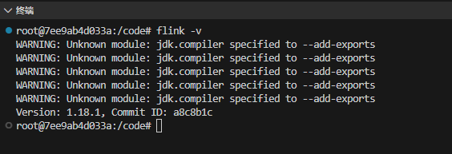

taskmanage-2

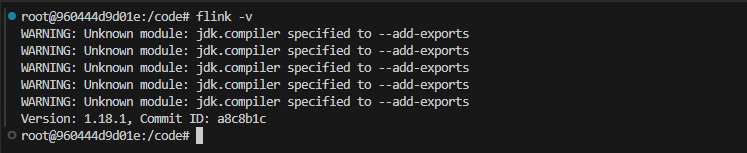

#### **步骤 2：编译并打包实验程序**

使用 Maven 构建，生成可执行的  JAR

编译脚本：

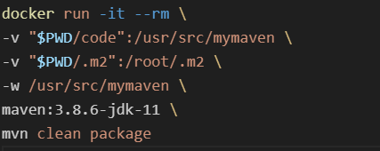

编译成功：

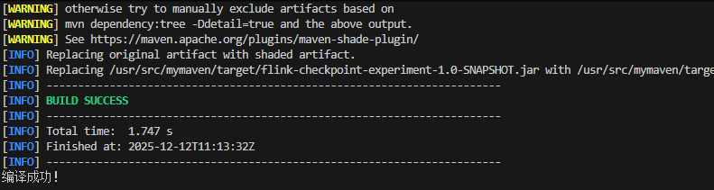

#### **步骤 3：提交 Flink 作业**

使用 `flink run` 提交作业，并传入实验参数

提交脚本：

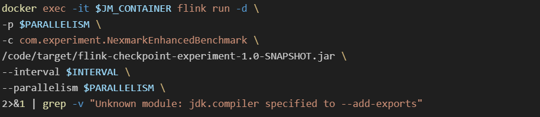

提交成功

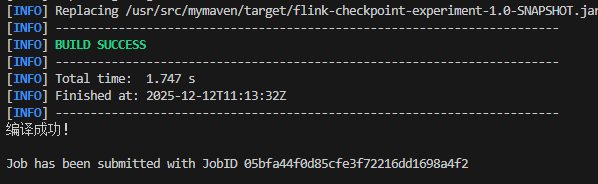

#### **步骤 4：验证作业运行状态**

通过 Flink Web UI确认作业正在运行

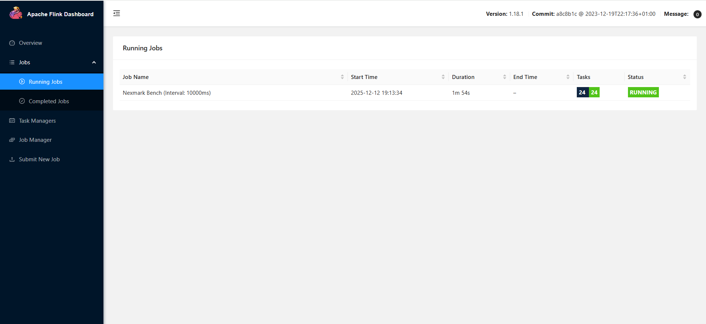

#### **步骤 5：监控端到端延迟指标**

利用python代码，通过 Flink REST API收集指标

### 实验结果与分析

#### **吞吐量（Throughput）**

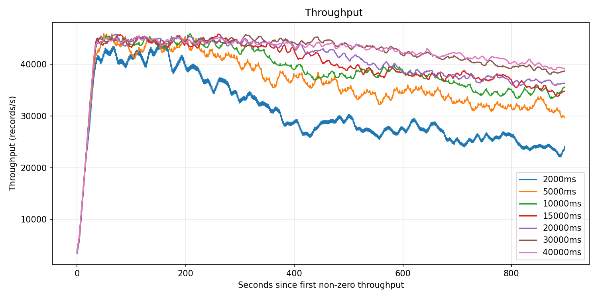

所有间隔下，吞吐量曲线都是：。对于2000ms，由于间隔越过短，基本没有出现平稳期，就开始剧列下降，而且间隔点越短，后期下降越明显，最终稳定吞吐明显低于其他配置。
间隔在 10000–40000ms 时，平台更长、后期衰减更慢，长期稳定吞吐更高、曲线更平滑。

过短的检查点间隔显著拖累长期吞吐；
中长间隔（≥10000ms，特别是 20000–30000ms）可以获得更高、更稳定的吞吐

##### 解释：

每次做 checkpoint 都有额外 I/O、状态快照、对下游算子的阻塞等开销。间隔越短，单位时间内 checkpoint 次数越多，系统更频繁进入“保存状态”状态，等价于周期性打断正常处理，长期看会压低有效处理能力。
间隔拉长后，同样时间内 checkpoint 次数减少，固定开销被摊薄，吞吐更高；同时 CPU/网络更多用于业务流量，曲线也更平滑。

##### 结论：

短间隔（2000–5000ms）：吞吐长期被频繁 checkpoint 拖累，后段下降最严重。
中等间隔（10000–20000ms）：峰值略高，平台长、衰减慢，是“高吞吐 + 稳定”的主力区间。
超长间隔（30000–40000ms）：在实验时间窗口内吞吐表现最佳，但要结合恢复时间和风险看。

#### **延迟（Latency）**

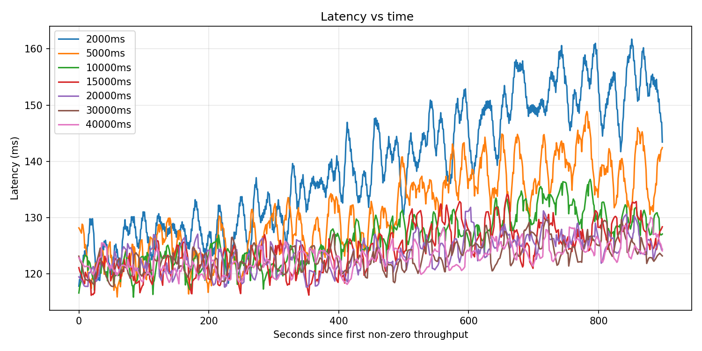图1  latency 

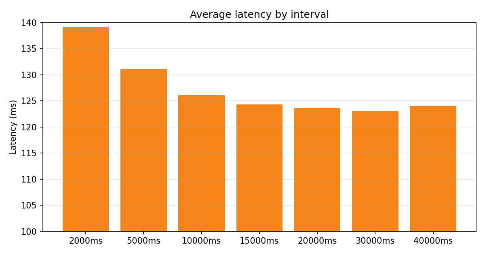图2 latency_mean

##### 现象

所有间隔下，延迟都是**缓慢上升 + 周期性波动**，而且除了2000ms和5000ms的延迟显著高于其他实验组之外，剩下的延迟差距并没有很大。平均延迟排序大致是最高：2000ms,其次：5000ms,最低一档：10000~30000ms，几条线挤在一起，差异不大；

##### 解释

checkpoint 时，算子或 sink 侧往往需要同步：写状态、与外部存储交互、对齐 barrier 等，这期间：
处理速率下降，输入数据在缓冲和队列里暂时堆积；
堆积的结果就是排队时间增加，转换成更高的端到端延迟。

##### 结论

太频繁的 checkpoint（例如2000ms）稳定抬高延迟，是延迟最差的配置。10000–30000ms 区间给出了延迟最平衡、最稳定的结果。
40000ms 在延迟上略有反弹，说明超长间隔开始显现单次 checkpoint 很重带来的局部积压。

#### **检查点持续时间**

##### 现象

所有间隔下，曲线都不是“严格水平线”，而是缓慢上扬：
2000ms：起点在 2–3 秒附近，后半段可升到十几秒；
5000ms：从约 5–7 秒起步，后面涨到 20 秒级别；
10000-20000ms：起点十几秒，后段升到 20–30+ 秒；
30000/40000ms：整体在最高的一组，起点三十几秒，后段可接近或超过 40–50 秒。

##### 解释

checkpoint 持续时间 ≈ 写出的状态量 / 有效写带宽：
间隔越大，两次 checkpoint 间累积的状态变化越多，状态膨胀更明显，从而在 checkpoint 时一次性写出更多数据。

##### 结论

真实 checkpoint 完成间隔普遍大于配置值，而且会随运行时间增加。
间隔越大，这种拖长越明显：40000ms 曲线比 20000ms 更向上抬。

#### 故障恢复时间

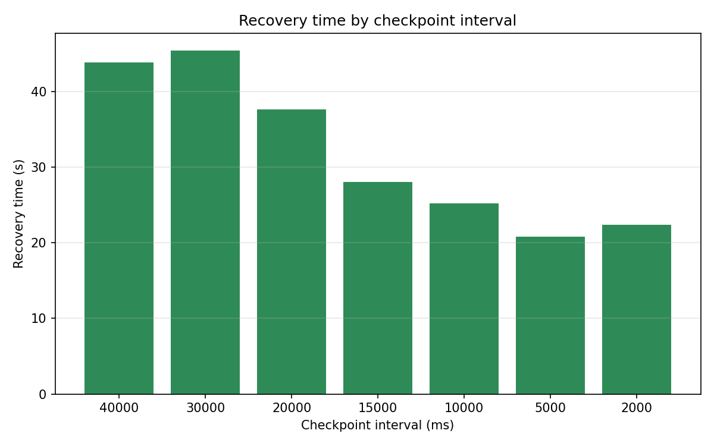

##### 现象

理论上来说，故障恢复时间应该和检查点间隔有非常明显的线性关系，然而从图像中来看，只有随着检查点间隔上升，恢复时间越来越高的趋势，而不是理想的线性关系。

##### 解释

恢复时间主要由故障发生时间到最近一次检查点完成时间的间隔决定，由于故障发生的时间不确定，他可能在一个检查点刚完成的时候出现，也可能在检查点完成过了一段时间之后再出现，这可能会导致测得现象不明显，虽然实验采取了多次测量取平均值的方式，并使用了效果最好的一组实验数据，但仍然不能完美复刻理论情况。

##### 结论：

短/中等间隔主要牺牲的是吞吐和延迟；超长间隔开始严重牺牲恢复时间，故障恢复时间和检查点间隔还是有明显的正相关性，数据显示，在5000到15000表现较好

### 结论

综合这些维度：吞吐 + 延迟 + 恢复时间

2000ms：吞吐最差、延迟最高；恢复时间略好但没有好到“压倒性优势”（22s vs 20–28s）。整体偏保守、代价过大，不推荐。
5000–10000ms：吞吐明显优于 2000ms；延迟已经显著下降；恢复时间仍在 20–25s 范围内，非常可控。适合对恢复敏感、又希望吞吐/延迟不要太差的场景。
15000–20000ms：吞吐和延迟都表现较好，是综合表现最平衡的一档；恢复时间 28–38s，中等偏上但大多场景可接受。适合作为“默认推荐区间”。
30000–40000ms：长期吞吐最好、延迟仍然可接受；但恢复时间显著变长（45–51s），且 checkpoint 持续时间和间隔的尾部风险增大。

因此对于本次实验的负载，15000-20000ms左右的检查点间隔最为合适

### 分工

